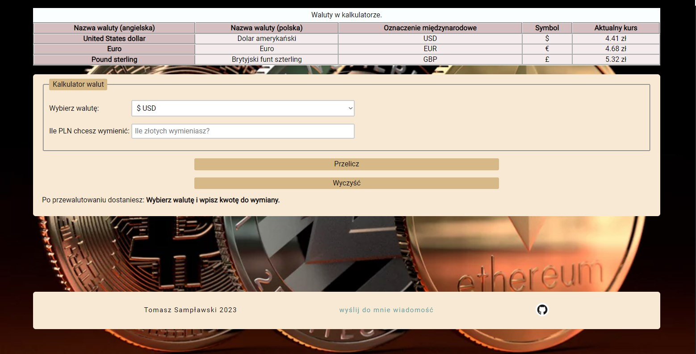

# Currency converter
A simple currency conversion application built with React.js. The application allows users to convert Polish Zloty (PLN) into various world currencies using real-time exchange rates fetched from an external API.

You can try it under this [link](https://samplawski.github.io/currency-converter-react/).

## Table of Contents

1. Short description
2. Features
3. Technologies Used
4. Smart Caching Logic (Technical Highlight)
5. Key Project Structure Improvements
6. Setup
7. How to use
8. Status and Contributing
9. Contact

## 1. Short Description
This project is a complete refactor of a vanilla JavaScript application into a modern React environment. The application allows users to convert PLN (Polish Złoty) into various currencies (USD, EUR, GBP, BTC). 

The main focus of this refactor was to implement a professional styling architecture using Styled-components and advanced state management through Custom Hooks.

## 2. Features
- Real-time Data: Fetches the latest exchange rates from a server using Axios.
- Precision Engine: Specialized rounding logic that ensures the calculator results match the visual rates shown in the table (eliminating common float errors).
- Dynamic Currency Table: Displays a list of popular currencies with their current rates.
- Support for Exotic Currencies: Handles extremely low-value currencies (e.g., BTC, ZWL) with high decimal precision to prevent Infinity errors.
- Modern UI/UX:
    - Responsive design using Styled-components.
    - Loading state with a 1.5s delay to ensure smooth transitions.
    - Error handling for network issues or failed API requests.
    - Real-time clock with the date of the last API update.

## 3. Technologies Used
- **React 19** (Functional components, Hooks: `useState`, `useEffect`, Custom Hooks )
- **Styled Components** (CSS-in-JS for modular and dynamic styling, Theming)
- **Axios** (Handled with asynchronous logic and error boundaries)
- **JavaScript (ES6+)**
- **Intl API** (For professional date and number formatting)
- **HTML5** (Semantic structure)
- **npm** (Package management)

The following external libraries are used in this project:

- normalize.css - for consistent styling across browsers
- Google Fonts - for the "Roboto" font used throughout the page
- gh-pages - for simplified deployment to GitHub Pages.

## 4. Smart Caching Logic (Technical Highlight)
To optimize API usage and respect the server's update cycle (updated at 23:59:59Z, which is 00:59:59 CET), the app implements an intelligent caching strategy in localStorage:

- The Midnight Gap: The app recognizes that between 00:00 and 01:00 AM CET, the server has not yet refreshed its data.

- Validation: It prevents redundant API calls during this hour by trusting the existing cache.

- Daily Sync: After 01:00 AM, the app performs exactly one API request to fetch the new day's rates and then resumes using the cache for the remainder of the 24-hour cycle.

## 5. Key Project Structure Improvements
During the refactor, the following advanced React patterns were implemented:
- **ThemeProvider:** Centralized color palette and breakpoints in `theme.js`.
- **GlobalStyle:** Removed `index.css` in favor of `createGlobalStyle`.
- **Logic Extraction:** Separated business logic (conversion, rate fetching) from the presentation layer (JSX).
- **Atomic Components:** The app is divided into small, specialized components like `Table`, `Converter`, `Clock`, and `Footer`.

## 6. Setup

To run this application locally, follow these steps:

- Clone the repository to your local machine using git clone [https://github.com/samplawski/currency-converter-react.git](https://github.com/samplawski/currency-converter-react.git)
- Navigate to the project directory using cd currency-converter-react
- Install dependencies (Use your preferred package manager): npm install OR yarn install
- Start the development server: npm start OR yarn start
- The application will open automatically in your browser (usually at http://localhost:3000/currency-converter-react).

## 7. How to use
1. Visit the converter page.
2. Select the currency you want to convert to from the dropdown list.
3. Enter the amount of PLN you want to exchange in the input field.
4. Click the "Przelicz" button to see the converted amount.
5. The "Wyczyść" button resets the form
6. View the current exchange rates in the table above the converter.

## 8. Status and Contributing
The project was created by Tomasz Sampławski. The core styling and logic refactor is complete. Future updates may include fetching real-time data from an external API.

Contributions, issues, and feature requests are welcome!

## 9. Contact
If you want to contact me you can reach me at tsamplawski@gmail.com.
